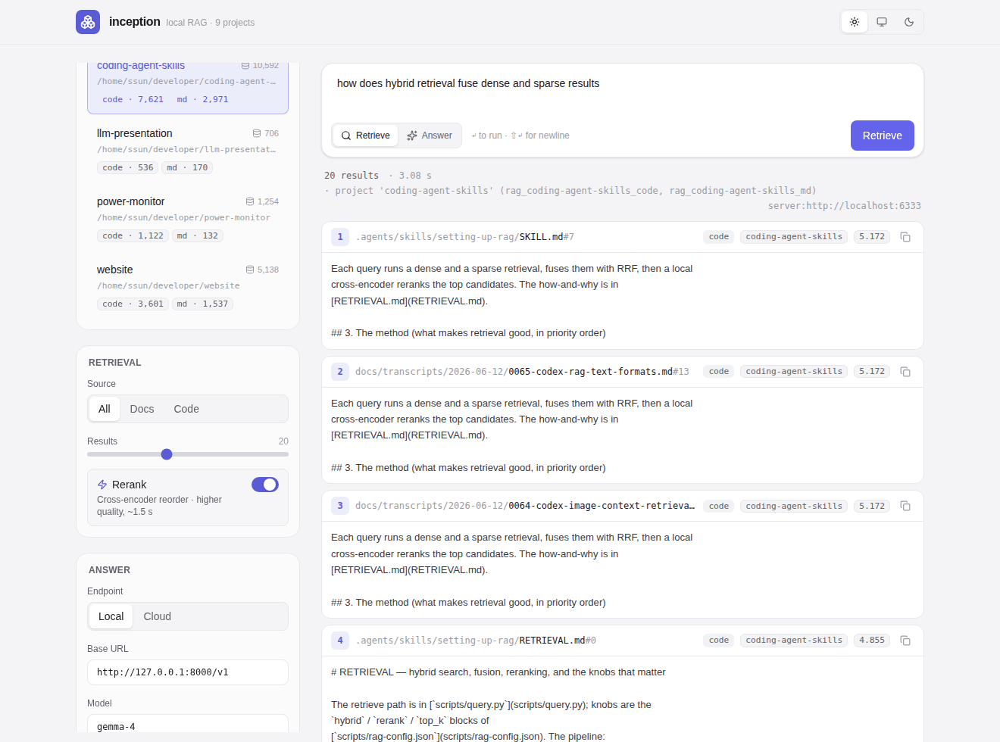

# inception

A modern, minimal web GUI for the repository's **local RAG system** (the
`setting-up-rag` skill). Browse the indexed projects, tune query-time
parameters, retrieve ranked chunks, and optionally generate a grounded answer
with a local or cloud LLM — in light or dark mode.



## Stack

- **TanStack Start** + **TanStack Router** (file-based routing) on **Vite 8**
- **React 19** with the **React Compiler** (automatic memoization — no manual
  `useMemo` / `useCallback` / `memo`). Data flows through a route **loader** +
  **`useActionState`**; theme state via **`useSyncExternalStore`**.
- **Bun** runtime / package manager · **TypeScript 7** (`tsgo`) · **Tailwind v4**
- A small **stdlib Python sidecar** (`rag-service/serve.py`) that holds the
  embedding/reranker models warm and serves retrieval + answering over HTTP.

## Architecture

```
browser ──▶ TanStack Start server fns ──▶ rag-service/serve.py ──▶ Qdrant + FastEmbed
 (UI)        (src/server/rag.ts)            (warm sidecar :8390)      (the setting-up-rag stack)
```

Shelling out to `query.py` per request would reload the models every call
(~4 s). The sidecar imports `rag_lib` + `answer` **once** and keeps the dense /
sparse / cross-encoder models hot, so retrieval is ~0.03 s without reranking and
~1.5 s with it. `bun run dev` launches the sidecar and Vite together.

## Run

Prerequisites: the local RAG stack from `setting-up-rag` must be set up — the
rag-skill venv (`~/.cache/rag-skill/venv`), a running **Qdrant** on `:6333`, and
at least one indexed project (`projects.json`). Check with
`.agents/skills/setting-up-rag/scripts/check-local-rag.sh`.

```bash
bun install     # from this directory
bun run dev     # starts the warm sidecar + dev server → http://localhost:3000
```

### Scripts

```bash
bun run dev        # sidecar + web (one command)
bun run dev:web    # web only (Vite) — expects a sidecar already running
bun run dev:rag    # warm RAG sidecar only
bun run build      # production build
bun run typecheck  # tsgo --noEmit
bun run test       # vitest
```

## Configuration (env)

| Variable           | Default                                    | Purpose                                                              |
| ------------------ | ------------------------------------------ | -------------------------------------------------------------------- |
| `RAG_SERVICE_PORT` | `8390`                                     | Sidecar port                                                         |
| `RAG_SERVICE_URL`  | `http://127.0.0.1:8390`                    | Where server fns reach the sidecar                                   |
| `RAG_PYTHON`       | `~/.cache/rag-skill/venv/bin/python`       | Python that has qdrant-client + fastembed                            |
| `RAG_SCRIPTS_DIR`  | `../.agents/skills/setting-up-rag/scripts` | Source of `rag_lib` + `answer`                                       |
| `RAG_LLM_*`        | —                                          | Default base URL / model / key for answering (overridable in the UI) |

The **Answer** panel sets the LLM endpoint (Local / Cloud), model, key, and
sampling at query time; these persist in `localStorage`. Retrieval needs no LLM.

## Layout

- `rag-service/serve.py` — warm retrieval/answer sidecar (stdlib HTTP).
- `scripts/dev.mjs` — launches sidecar + Vite; `scripts/_rag.mjs` resolves paths.
- `src/server/` — `createServerFn` proxies (`rag.ts`) + the sidecar client (`rag-service.ts`).
- `src/components/` — the GUI; `src/lib/` — theme store, settings, formatting.
- `src/routes/index.tsx` — loads projects in a loader and renders the app.
